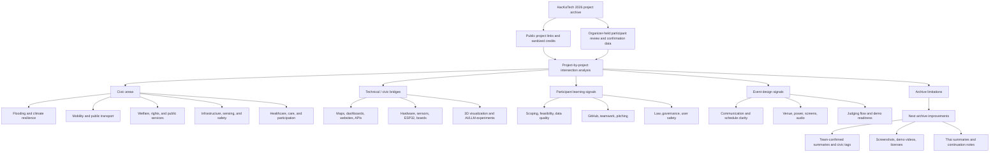

# HacKaTech 2026: Thai Teen Civic Tech Archive 🛸
### *An open archive of youth-led civic technology projects for Bangkok and Thailand’s public future.*

  

> **"Code the city before the city codes you."**  
> *เมื่อวัยรุ่นขอเคลียร์เส้นทาง ปูพรมรหัสโอเพนซอร์สเพื่อลุยเมืองกรุงเทพฯ พ.ศ. 2569*

---

## ⚡ Hey, Yo! What is this?
Welcome to the handcrafted, official time-capsule repository of **HacKaTech BKK 69** (BE 2569 / 2026 CE)! 

From **June 18-20, 2026**, Bangkok's most active teen builders (ages 15–24) locked themselves in the NEXTOPIA Community Center (Siam Paragon). The mission? Build open-source, politically neutral city tech. The twist? A week later was the **June 28, 2026 Bangkok Governor Election**, and our top teams pitched their working code live on-stage directly to the Gubernatorial Candidates!

This repository archives the software, hardware, and deployment repositories built during those crazy 3 days. No marketing fluff, no boring PDF lists—just pure developer-to-developer public goods.

---

## 📂 Repository Blueprint
*   📂 [`data/projects.json`](./data/projects.json) - Machine-readable JSON database of all projects.
*   📂 [`projects/`](./projects/) - Individual markdown files detailing each submission, tech stack, and creators.
*   📂 [`docs/event-archive.md`](./docs/event-archive.md) - The full narrative, key goals, and organizers' statement.
*   📂 [`docs/registration.md`](./docs/registration.md) - Participant metrics, registration guidelines, and templates.
*   📂 [`docs/credits.md`](./docs/credits.md) - Full credits cataloging creators, nickname records, and teams.
*   📂 [`docs/methodology.md`](./docs/methodology.md) - How we compiled, normalized, and verified these records.
*   📂 [`docs/project-intersections.md`](./docs/project-intersections.md) - Analysis of how submitted projects connect to civic-tech themes, youth perspectives, and event learning.
*   📂 [`docs/license-and-attribution.md`](./docs/license-and-attribution.md) - IP protection and CC BY 4.0 terms.

### Project Intersections Map

---

## 📺 The Live Debate Showdown (ศึกดีเบตพลิกกรุง)
Watch the final onstage policy debate held **June 20, 2026** at NEXTOPIA, Siam Paragon, where the top 3 youth projects were pitched live to Gubernatorial Candidates from **พรรคเศรษฐกิจ (Economic Party)** and **กลุ่มกรุงเทพบินได้ (Flying Bangkok Group)**!

*   🎥 **Watch Recording on YouTube:** [HacKaTech BKK 69 Onstage Debate Live Stream](https://www.youtube.com/live/vClGZcDhQl4?si=wq-6lOUIwcGgToSq)

---

## 📊 Registration & Participation Statistics (สถิติการรับสมัคร)

We had high engagement from the community! Check out the numbers:
*   👥 **Total Registrations:** **284 people** applied to join the hackathon.
*   🏢 **Confirmed Onsite:** **110 people** confirmed and participated onsite at NEXTOPIA, Siam Paragon.
*   🌐 **Confirmed Online:** **107 people** confirmed and participated in the virtual hackathon round.

### 📄 Submission Requirements (ต้องส่ง: เอกสาร)
*   **Project Document Template:** 📑 [Template - HacKaTech_ ศึกชิงเก้าอี้ผู้ว่ากทม69 (2).docx](./docs/Template%20-%20HacKaTech_%20%E0%B8%A8%E0%B8%B6%E0%B8%81%E0%B8%8A%E0%B8%B4%E0%B8%87%E0%B9%80%E0%B8%81%E0%B9%82%E0%B8%B2%E0%B8%AD%E0%B8%B5%E0%B9%89%E0%B8%95%E0%B8%B9%E0%B9%89%E0%B8%A7%E0%B9%88%E0%B8%B2%E0%B8%81%E0%B8%97%E0%B8%A169%20(2).docx) must be sent when registering.
*   **Verification Docs:** Certified ID copy and Parental Consent forms (**ทำสำเนา ไปพิมพ์เอง**).

Check out [registration.md](./docs/registration.md) for details on document formats and the onboarding schedule.

---

## 🛠️ The 22 Project Gallery

Here is the complete project directory (including 19 active projects and 3 inactive repositories preserved for historical context). 

> ⚠️ **Note on unpublished prototypes & mentoring limits:** While the main active repositories are listed below, there were more projects created at the event. Due to the intense 48-hour timeline and limited technical git-mentoring, some teams ran their code locally or developed on pre-existing web platforms rather than publishing standalone public repositories. We are committed to improving technical onboarding and guidance in our next HacKaTech events.

| Project Name | Primary Creator / Team | Civic Focus | Tech Stack | Link | Status |
| :--- | :--- | :--- | :--- | :--- | :--- |
| **BKFloodSnap** | KNovate | FLOODING | HTML, CSS, JavaScript | [Link](https://github.com/16Krae/BKFloodSnap) | 🟢 ACTIVE |
| **BkkMicroflow** | Inwzaบดินทร2_007 | FLOODING | Unspecified | [Link](https://github.com/MyTxweProgrammit/BkkMicroflow) | 🟢 ACTIVE |
| **Bubble Ideas Hub** | CONNEXT BKK | OTHER | HTML, CSS, JavaScript | [Link](https://github.com/Kulachat2/bubble-ideas-hub) | 🔴 INACTIVE (404) |
| **chicken.4r1n-hackatech-2026** | chicken.4r1n | ENVIRONMENT | HTML, CSS | [Link](https://github.com/Lewyns/chicken.4r1n-hackatech-2026) | 🔴 INACTIVE (404) |
| **CityFlowBKK** | พยัคฆ์เมฆา x รัตติกาล | MOBILITY | Android (Java/Kotlin), XML | [Link](https://github.com/tanth123-h/CityFlowBKK) | 🟢 ACTIVE |
| **CoolZone** | chicken.4r1n | ENVIRONMENT | Python, Flask, JavaScript | [Link](https://github.com/Lewyns/coolzone) | 🟢 ACTIVE |
| **FangMueang (ผังเมือง)** | Comsci | OTHER | Unspecified | [Link](https://github.com/Ikkiw06/fangmueang) | 🟢 ACTIVE |
| **Flow** | CAIRO โฟลว์ตามฟีล | MOBILITY | JavaScript, Web App, Leaflet/Map API | [Link](https://github.com/nicenathapong/flow) | 🟢 ACTIVE |
| **CareKan** | เจ็ดจริงดิ ! | PUBLIC SERVICES | React, Express, Node.js | [Link](https://github.com/ksrddd/hackatech-CareKan) | 🟢 ACTIVE |
| **Thinkkhaya (ถิงขยะ)** | SixDucks | ENVIRONMENT | Arduino, C++ | [Link](https://github.com/TleNotGoodAtPython/hackatech-public-SixDucks) | 🟢 ACTIVE |
| **Hackatechwork** | พญามารน้ำท่วม | FLOODING | HTML, CSS, JavaScript | [Link](https://46045-lab.github.io/Hackatechwork/) | 🔴 INACTIVE (404) |
| **JaiD (ใจดี)** | Because you are future | WELFARE | Unspecified | [Link](https://github.com/Saltypoptato/JaiD) | 🟢 ACTIVE |
| **Abjust (แอบจัดส์)** | AyaYA | MOBILITY | Web App (React/HTML/JS) | [Link](https://github.com/wwwx3/JustServexRoadWisdom-) | 🟢 ACTIVE |
| **Loop to Token** | อัศวินรัตติกาล | ENVIRONMENT | Unspecified | [Link](https://github.com/SOGUY144/loop-to-token) | 🟢 ACTIVE |
| **Meetfan** | NoPlan | PUBLIC SERVICES | Next.js, TypeScript, Tailwind CSS | [Link](https://github.com/siwakron12/Meetfan) | 🟢 ACTIVE |
| **Meetfans** | NoPlan | PUBLIC SERVICES | Next.js, TypeScript, Tailwind CSS | [Link](https://github.com/razfordz/Meetfans) | 🟢 ACTIVE |
| **Smart Shade & Light** | smnt67 | PUBLIC INFRASTRUCTURE | HTML, CSS, JavaScript (Static deployment) | [Link](https://oshik2551-cmd.github.io/smartpole/) | 🟢 ACTIVE |
| **SubSense BKK** | I love my job | PUBLIC INFRASTRUCTURE | JavaScript, Web App, BMA GIS | [Link](https://github.com/picellmeem/subsense-bkk) | 🟢 ACTIVE |
| **Thairutan (ไทยรู้ทัน)** | SKC NewHorizon | COMMUNITY SAFETY | Unspecified | [Link](https://github.com/bexm169-ops/Thairutan_) | 🟢 ACTIVE |
| **TransitFlow** | Flip flops | MOBILITY | Node.js, JavaScript, HTML, CSS | [Link](https://github.com/pluemW1/transitflow) | 🟢 ACTIVE |
| **UrbanFlow** | U-R-banFlow | MOBILITY | HTML, CSS, JavaScript, Node.js | [Link](https://github.com/Jaturapat-Buak/UrbanFlow) | 🟢 ACTIVE |
| **Welfare Gap Finder** | 1นาทีเห็นเธอพึ่งตอบแชต | WELFARE | Python, RAG, Typhoon LLM | [Link](https://github.com/pngkcwtk/Welfare-Gap-Finder) | 🟢 ACTIVE |

---

## 💌 A Message from the Organizers (ถ้อยแถลงจากผู้จัดงาน)
> **"เพราะการเปลี่ยนแปลงสังคม ไม่ได้เริ่มต้นจากคนที่มีอำนาจเสมอไป แต่อาจเริ่มจากคนตัวเล็ก ๆ ที่กล้าตั้งคำถาม กล้าลงมือทำ และกล้าเชื่อว่าอนาคตสามารถดีกว่าเดิมได้"**  

This event marks the kickoff of the **HacKaTech** series! We will continue building and expanding under the hashtags **#HacKaTech** and **#HacKaTechศึกพลิกอนาคตกทม**. Follow the journey on social media via **#HacKaTechศึกพลิกอนาคตกทม69**. 

A massive thank you to all teen builders who joined and co-created this historic milestone. For the first time in Thailand, the voices of hundreds of youth tech builders reached the ears of those in political power. Keep fighting for your beliefs in Civic Tech!

*   📸 **Explore the Gallery:** [HacKaTech BKK 69 Photo Gallery / ภาพบรรยากาศทั้งหมด](https://drive.google.com/drive/folders/197ceTguPbsm9_-i00oghz_Ydl-ugVHde?usp=drive_link)

---

## 🤝 Event Co-Creators & Partners

This massive sandbox was hand-crafted by:

*   **💡🛸 CIA CreativeLab, CreativeLabTH Group**
*   **🇺🇲🇹🇭 Resilience Collective Thailand** (In collaboration with **MIT Urban Risk Lab, Massachusetts Institute of Technology**)
*   **♻️🌱 NEXTOPIA, Siam Paragon**
*   **💱🤖 KBTG, K Bank**
*   **Media Partner:** **Spaceth.co**
*   **Sponsored by:** **FURE WOOD ไม้อัดลำลูกกา** — *ตัวแทนจำหน่ายไม้สำหรับงานตกแต่งและงานเฟอร์นิเจอร์แบบครบวงจร ย่านลำลูกกา ปทุมธานี มีบริการตัดไม้ตามขนาด*
*   **qBraid** — *The World's Most Connected Quantum Computing Platform*
*   **Pubpub production** — *ทีมงาน production ที่สั่งปุ๊บ ๆ ได้ปั๊บ ๆ แฮ่*

---

## 🔒 Attribution & Legal Stuff
We respect the grind:
1.  **Ownership:** Participants own 100% of their repositories. This is just an index.
2.  **License:** Check individual repos for licenses. If they didn't specify one, ask nicely before copying.
3.  **BMA Integration:** All active codebases are open for BMA inspection under Open Data guidelines.
