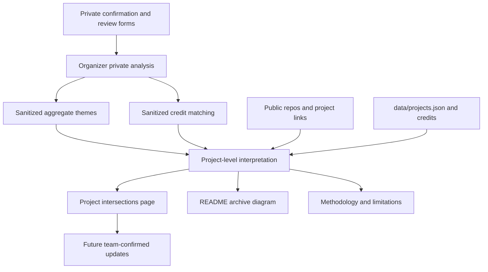
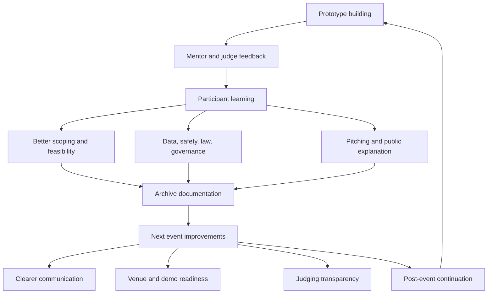

# Project Intersections: What the HacKaTech Projects Reveal

## Why this page exists

This page reads the HacKaTechBKK69 archive as a civic-tech map of Thai youth-built prototypes in 2026. It is not a scoreboard and it is not a product catalogue. It asks what the project set reveals about public problems, technical imagination, participant learning, and event design.

The archive matters because hackathon prototypes often disappear after the event. By documenting the projects together, the repository preserves a public record of how young builders translated Bangkok and Thailand's civic problems into maps, dashboards, websites, APIs, sensors, physical prototypes, AI experiments, and demos.

## How to read this analysis

- This is not a ranking.
- These are early hackathon prototypes, not finished public systems.
- Some project details are inferred from public repo names, public project links, sanitized credits, repo metadata, and aggregate review themes.
- Private spreadsheets are not published in this repository.
- Personal information is excluded.
- Team-confirmed summaries should replace inferred notes when available.
- Language such as "appears to," "suggests," and "may reflect" marks interpretation, not certainty.

## Evidence base and privacy boundary

The organizer privately analyzed online and onsite confirmation/review data, then converted that material into aggregated, non-identifying themes before publication. The public archive does not expose raw responses, private comments, participant contact details, payment details, health notes, emergency contacts, or raw form rows.

The evidence base for this page is:

- 34 online review responses, analyzed privately and summarized as aggregate themes.
- 47 onsite review responses, analyzed privately and summarized as aggregate themes.
- 107 online confirmation rows, used internally for archive matching and then sanitized.
- 110 onsite confirmation rows, used internally for archive matching and then sanitized.
- 22 archived project entries from `data/projects.json`, `docs/credits.md`, public project links, and sanitized project-level notes.

The repo does not contain the Excel files or private forms. This page is an interpretive archive layer, not a raw survey release.

The optional files `docs/organizer-retrospective.md`, `docs/improvement-roadmap.md`, and `data/feedback_themes.json` were not present in the local repository when this revision was prepared. Where those files become available later, this page should be revised against them.

## Overview: the civic map of the archive

The projects cluster around everyday public systems: floods, transport, welfare, rights, public infrastructure, healthcare, environment, reporting, and public-service access. Many teams started with ordinary friction: unclear services, unsafe or hard-to-read streets, invisible risks, fragmented public information, limited data access, and the difficulty of communicating with institutions.

Participants translated these civic problems into interface objects: web apps, dashboards, maps, APIs, forms, sensors, physical prototypes, and demos. This matters because an interface is not just a screen. In this archive, an interface becomes a way to make a public problem visible, testable, explainable, and discussable.

The archive should be read as a record of civic imagination at prototype scale. It shows what young builders thought was worth making visible, what technical forms they reached for, and where event design helped or constrained their ability to demonstrate the work.

## Deep diagrams

### Archive evidence pipeline

### Project clusters by civic problem

```mermaid
flowchart TD
    A["22 archived projects"] --> B["Flooding / Climate resilience"]
    A --> C["Mobility / Transit"]
    A --> D["Welfare / Rights / Public services"]
    A --> E["Infrastructure / Sensing / Safety"]
    A --> F["Healthcare / Care"]
    A --> G["Environment / Circular systems"]
    A --> H["Participation / Civic voice"]
    A --> I["Needs manual review"]

    B --> B1["BKFloodSnap"]
    B --> B2["BkkMicroflow"]
    B --> B3["Hackatechwork"]

    C --> C1["CityFlowBKK"]
    C --> C2["TransitFlow"]
    C --> C3["UrbanFlow"]
    C --> C4["Flow"]
    C --> C5["Abjust"]

    D --> D1["Welfare Gap Finder"]
    D --> D2["JaiD"]
    D --> D3["Thairutan"]
    D --> D4["Meetfan / Meetfans"]

    E --> E1["Smart Shade and Light"]
    E --> E2["SubSense BKK"]
    E --> E3["Thairutan"]

    F --> F1["CareKan"]
    F --> F2["JaiD"]

    G --> G1["Thinkkhaya"]
    G --> G2["Loop to Token"]
    G --> G3["CoolZone"]

    H --> H1["FangMueang"]
    H --> H2["Bubble Ideas Hub"]

    I --> I1["Meetfans"]
    I --> I2["Meetfan"]
    I --> I3["chicken.4r1n-hackatech-2026"]
    I --> I4["Flow"]
```

### Learning and event-design feedback loop

## Project matrix

| Project | Team | Format | Civic area | Technical bridge | Learning signal | Credit confidence | Documentation need |
| :--- | :--- | :--- | :--- | :--- | :--- | :--- | :--- |
| Thairutan | SKC NewHorizon | onsite | rights, welfare info, civic data access | warning/info dashboard; technical stack unspecified | rights, data, safety, backend | high | confirm civic tag and stack |
| Thinkkhaya | SixDucks | onsite | waste, infrastructure, environment sensing | Arduino/C++, ESP32, ultrasonic sensing | hardware/software integration | high | confirm hardware details from repo |
| Welfare Gap Finder | 1นาทีเห็นเธอพึ่งตอบแชต / What's your name? | onsite | welfare and rights gap | Python, RAG, Typhoon LLM | rights, governance feasibility | partial | resolve duplicated repo credit |
| Hackatechwork | พญามารน้ำท่วม | onsite | flooding, disaster information | HTML/CSS/JS web dashboard | LLM limits, flood data, demo stress | high | inactive deployment and demo notes |
| Smart Shade & Light | smnt67 | onsite | smart infrastructure, shade/light safety | static HTML/CSS/JS public page | budget and feasibility | high | confirm implementation details |
| CareKan | เจ็ดจริงดิ ! | onsite | healthcare and public services | React, Express, Node.js | hospital complexity, requirements | high | avoid medical claims |
| CityFlowBKK | พยัคฆ์เมฆา x รัตติกาล | onsite | mobility and transport | Android app | GitHub, app-building, usability | high | confirm feature-level claims |
| BKFloodSnap | KNovate | onsite | flooding and civic reporting | HTML/CSS/JS web reporting | map API, risk tracking | high | verify deployment and map details |
| Meetfans | NoPlan | onsite | public interaction, needs review | Next.js, TypeScript, Tailwind | backend, safety, feature design | high | team-confirmed civic summary |
| chicken.4r1n-hackatech-2026 | chicken.4r1n | onsite | needs manual review | HTML/CSS; inactive repo | fatigue, judge feedback | high | 3-5 sentence public summary |
| Abjust | AyaYA | onsite | roads, reports, mobility | React/HTML/JS web app | algorithmic thinking | partial | verify team/project identity |
| FangMueang | Comsci | onsite | civic listening, planning | technical stack unspecified | communication, presentation | high | confirm function and stack |
| Meetfan | NoPlan | onsite | related public interaction tool, needs review | Next.js, TypeScript, Tailwind | broader design thinking | inferred | decide merge vs separate project |
| Flow | CAIRO โฟลว์ตามฟีล | onsite | mobility/service flow | JavaScript web app, Leaflet/Map API | adoption, teamwork, blind spots | high | confirm exact civic-flow concept |
| CoolZone | chicken.4r1n | onsite | heat resilience, cooling access | Python, Flask, JavaScript | libraries, APIs, preparation | high | technical README review |
| BkkMicroflow | Inwzaบดินทร2_007 | online | flooding and water flow | unspecified; 3D/hardware signals from review | Three.js, boards, feasibility | partial | clarify stack and credit |
| Loop to Token | อัศวินรัตติกาล | online | circular economy | unspecified; hardware/software signals | market study, interviews | partial | clarify hardware and credit |
| SubSense BKK | I love my job | online | urban sensing, infrastructure | JavaScript, BMA GIS | cause analysis, planning | high | avoid over-specifying target |
| JaiD | Because you are future | online | care, welfare, public support | tech stack unspecified | data clarity, scale | partial | clearer civic tag and stack |
| Bubble Ideas Hub | CONNEXT BKK | online | civic ideas and participation | HTML/CSS/JS; inactive | motivation, Bangkok problems | inferred | inactive link and inferred credit |
| UrbanFlow | U-R-banFlow | online | urban systems, data, mobility | HTML/CSS/JS, Node.js | government APIs, depth | high | clarify mobility vs broader data |
| TransitFlow | Flip flops | online | public transport routing | Node.js, JS, HTML, CSS | Google Directions API, feedback | high | stronger transport-data README |

## Project-by-project intersection analysis

### Thairutan

**Original link:** [https://github.com/bexm169-ops/Thairutan_](https://github.com/bexm169-ops/Thairutan_)  
**Team:** SKC NewHorizon  
**Credit confidence:** high  
**Civic area:** public rights, welfare information, civic data access  
**Evidence status:** inferred

#### Civic intersection

Thairutan appears to address public rights literacy and access to government-related information. Based on the archive metadata, it is also described as a citizen warning dashboard and local alert aggregator, which connects rights, welfare information, civic data, and community safety.

In Bangkok and Thailand's civic context, this matters because residents often need to interpret public information across agencies, channels, and levels of government. A prototype that organizes warnings, services, or rights information suggests a youth-builder concern with making state-facing information easier to understand.

The interpretation remains partly uncertain. The public archive supports a broad information-access and warning-system reading, but the technical stack is not specified in `data/projects.json`, so the analysis should avoid claims about architecture or backend implementation.

#### Technical civic bridge

The project's technical bridge appears to be an information interface: a dashboard or aggregator that turns scattered public or civic information into something users can read and act on. If the system handles safety or rights information, its civic value depends on clarity, source quality, trust, and careful handling of user-facing risk.

It would become stronger with a team-confirmed README, source list, data update method, safety disclaimers, and a clear explanation of who the tool is for.

#### Participant-perspective reading

Sanitized feedback suggests learning around government rights, data, information safety, backend improvement, teamwork, and clearer organization of information. That combination may reflect the difficult shift from "show information" to "make public information usable and responsible."

The event signals connected to this project also point to fairness and process concerns: judging transparency, post-result coordination, crowded tables, plugs, and presentation fairness. Those concerns matter because civic-tech events teach process norms as much as code.

#### Risks, gaps, and future documentation needs

- Technical stack is unspecified in archive metadata.
- Civic tag should be confirmed by the team.
- License is listed as not specified.
- Needs a public summary explaining sources, update process, and user safety assumptions.
- Archive should avoid overclaiming backend or data architecture.

#### Suggested archive tags

`#public-rights` `#welfare` `#community-safety` `#civic-data` `#youth-civic-tech`

### Thinkkhaya

**Original link:** [https://github.com/TleNotGoodAtPython/hackatech-public-SixDucks](https://github.com/TleNotGoodAtPython/hackatech-public-SixDucks)  
**Team:** SixDucks  
**Credit confidence:** high  
**Civic area:** public infrastructure, waste/environment sensing, hardware prototype  
**Evidence status:** confirmed

#### Civic intersection

Thinkkhaya intersects with waste, environmental management, and the physical layer of public infrastructure. Archive metadata describes it as an IoT-enabled waste monitoring prototype that alerts local collectors when neighborhood bins are full.

This matters in an urban context because waste systems are physical, distributed, and often invisible until they fail. A sensor-based trash or bin-monitoring prototype makes a public-service problem measurable, which can help a team discuss timing, maintenance, routing, and responsibility.

The civic interpretation is well supported by the project metadata and sanitized feedback, but specific hardware implementation details should still be attributed carefully unless verified in the public repo.

#### Technical civic bridge

The public project metadata lists Arduino and C++. Sanitized feedback also mentions ESP32, ultrasonic sensors, physical prototyping, and modifying a trash bin. Together, these point to a hardware/software bridge between a physical public object and a digital alert or monitoring layer.

The project would be stronger technically and civically with sensor calibration notes, failure-mode documentation, power assumptions, maintenance plans, and a short explanation of who receives alerts and how collection decisions would be made.

#### Participant-perspective reading

The learning signals suggest that participants confronted the real difficulty of building civic tech outside the screen: hardware integration, physical construction, demo readiness, planning, pitching, and evidence-based claims. This is a different learning curve from a pure web app.

Feedback about nearby teams and making friends also suggests that onsite civic-tech learning was social. Seeing other prototypes likely helped teams compare evidence, feasibility, and presentation choices.

#### Risks, gaps, and future documentation needs

- License is listed as not specified.
- Hardware details should be confirmed against repo documentation.
- Needs demo photos or diagrams explaining sensor placement and data flow.
- Needs maintenance and deployment assumptions before any public-infrastructure claim.

#### Suggested archive tags

`#environment` `#waste` `#hardware` `#sensors` `#public-infrastructure` `#youth-civic-tech`

### Welfare Gap Finder

**Original link:** [https://github.com/pngkcwtk/Welfare-Gap-Finder](https://github.com/pngkcwtk/Welfare-Gap-Finder)  
**Team:** 1นาทีเห็นเธอพึ่งตอบแชต / What's your name?  
**Credit confidence:** partial  
**Civic area:** welfare, public service access, rights gap  
**Evidence status:** partial

#### Civic intersection

Welfare Gap Finder directly addresses welfare access and the gap between public services and people who need support. The public metadata describes a welfare budget gap visualizer using localized RAG over municipal documents with the Typhoon LLM.

This matters because welfare systems are not only about benefit design; they are also about whether people can understand eligibility, locate services, and see where public resources may not reach actual needs. A welfare-gap prototype can make those institutional gaps more visible and discussable.

The civic direction is clear, but credit matching is partial because multiple teams submitted the same repo link. The archive should mark that uncertainty rather than silently resolving ownership or collaboration questions.

#### Technical civic bridge

The technical bridge appears to combine Python, RAG, and an LLM workflow for public or municipal documents. This can help summarize and search welfare information, but it also creates risks around source quality, model limits, hallucination, and over-simplification of public benefits.

The project would be stronger with source-document documentation, retrieval evaluation, limitations, citation display, and a clear note that the prototype does not replace official welfare advice.

#### Participant-perspective reading

Sanitized feedback suggests learning around citizen rights, official roles, Bangkok governance feasibility, future public users, and project scope. That is a strong civic learning signal: the team appears to have moved beyond "can we build a tool?" toward "what can a city office actually do, and what should users trust?"

It also reflects a common youth civic-tech challenge: powerful ideas about rights and public services must be scoped carefully to avoid promising more than a prototype can provide.

#### Risks, gaps, and future documentation needs

- Credit status is partial because multiple teams submitted the same repo link.
- License is listed as not specified.
- Needs clear source citations and RAG limitations.
- Needs team-confirmed public summary and credit confirmation.
- Should avoid implying official welfare determinations.

#### Suggested archive tags

`#welfare` `#public-services` `#rights` `#open-data` `#rag` `#youth-civic-tech`

### Hackatechwork

**Original link:** [https://46045-lab.github.io/Hackatechwork/](https://46045-lab.github.io/Hackatechwork/)  
**Team:** พญามารน้ำท่วม  
**Credit confidence:** high  
**Civic area:** flooding, climate resilience, disaster information  
**Evidence status:** confirmed

#### Civic intersection

Hackatechwork intersects with Bangkok flooding, climate resilience, and disaster information. Archive metadata describes an interactive web dashboard for real-time flood monitoring and evacuation routing, currently marked inactive.

Flooding is a high-stakes civic problem in Bangkok because it affects mobility, safety, work, school, and access to services. A flood dashboard prototype suggests that the team treated flood resilience as both a data problem and a communication problem.

The project also shows uncertainty common to rapid prototypes: public-facing disaster tools need reliable data and resilient deployment, while hackathon demos often depend on unstable local or temporary setups.

#### Technical civic bridge

The archive lists HTML, CSS, and JavaScript. Sanitized feedback mentions flood information sources, UI response, AI/LLM limitations, technical terminology, step-by-step planning, and deployment stress.

The technical bridge is a web interface that tries to translate flood information into public decision support. It would become stronger with stable deployment, source documentation, data freshness indicators, accessibility checks, and clear warnings about uncertainty.

#### Participant-perspective reading

The feedback suggests that participants learned the limits of AI/LLM use in public-risk contexts. That is an important civic lesson: a model can help explore information, but public safety claims require reliability, evidence, and careful wording.

The project also reflects demo pressure. Deployment risk and local failures are not just technical inconveniences; they affect whether a civic idea can be evaluated by users, mentors, and judges.

#### Risks, gaps, and future documentation needs

- Archive metadata marks the deployment inactive/404.
- License is listed as not specified.
- Do not claim AI worked successfully.
- Needs data-source documentation and deployment status.
- Needs screenshots or a demo video if the live page remains unavailable.

#### Suggested archive tags

`#flooding` `#climate-resilience` `#dashboard` `#disaster-information` `#llm-limits`

### Smart Shade & Light

**Original link:** [https://oshik2551-cmd.github.io/smartpole/](https://oshik2551-cmd.github.io/smartpole/)  
**Team:** smnt67  
**Credit confidence:** high  
**Civic area:** public infrastructure, smart city systems, urban safety, shade/light infrastructure  
**Evidence status:** confirmed

#### Civic intersection

Smart Shade & Light intersects with smart public infrastructure: poles, shade, lighting, climate sensors, and urban safety. The archive metadata describes a smart utility pole project demonstrating solar-powered shade structures, climate sensors, and smart city street lighting.

This matters because ordinary street objects shape public comfort and safety. Shade, lighting, and sensor placement can affect heat exposure, walkability, and confidence in public space.

The broader civic question is feasibility. A smart pole is not only a device; it requires installation, maintenance, procurement, power planning, and a clear public benefit.

#### Technical civic bridge

The public metadata lists HTML, CSS, and JavaScript for a static deployment. The prototype appears to use a web presentation or interface to explain a physical infrastructure concept.

The project would be stronger with diagrams, component lists, budget assumptions, maintenance plans, and a clear explanation of which functions are prototype concepts versus implemented features.

#### Participant-perspective reading

Sanitized feedback suggests learning around budget feasibility, investment value, missing requirements, new tools, and practical city implementation. This is a useful sign: participants were pushed to think past the object and toward whether a city could actually support it.

That learning reflects a hard part of public technology. Civic infrastructure must survive cost, weather, maintenance, safety review, and institutional procurement.

#### Risks, gaps, and future documentation needs

- License is listed as not specified.
- Physical implementation details should be confirmed by the team.
- Needs budget and maintenance assumptions.
- Needs clearer distinction between concept render, prototype, and deployable system.

#### Suggested archive tags

`#public-infrastructure` `#smart-city` `#urban-safety` `#heat-resilience` `#youth-civic-tech`

### CareKan

**Original link:** [https://github.com/ksrddd/hackatech-CareKan](https://github.com/ksrddd/hackatech-CareKan)  
**Team:** เจ็ดจริงดิ !  
**Credit confidence:** high  
**Civic area:** healthcare, public services, community care  
**Evidence status:** confirmed

#### Civic intersection

CareKan intersects with healthcare and public-service access. The archive metadata describes a clinic finder and queue reservation portal for primary healthcare centers in Bangkok.

This matters because healthcare access is a service-navigation problem as well as a medical problem. People need to know where to go, what services are available, and how waiting or queue systems work.

The archive should frame CareKan as a service-design and public-service prototype, not as a medical product. The civic value is in reducing friction around care access and public information.

#### Technical civic bridge

The metadata lists React, Express, and Node.js. This suggests a full-stack web prototype that connects users to clinic information and possibly queue-reservation flows.

The project would be stronger with workflow diagrams, data-source notes for clinic directories, privacy assumptions, and clear language about whether any booking flow is simulated or connected to a real system.

#### Participant-perspective reading

Sanitized feedback suggests learning around hospital complexity, pain points, requirements, document reading, teamwork, pitching confidence, and mentor guidance. This may reflect a team learning that service systems are built from many small constraints.

The mentor signal is important. Healthcare and care-access prototypes benefit from domain guidance because assumptions that seem obvious to builders may not match real workflows.

#### Risks, gaps, and future documentation needs

- License is listed as not specified.
- Avoid medical claims.
- Needs data-source and privacy notes.
- Needs confirmation of whether queue features are simulated or integrated.
- Needs screenshots or user-flow documentation.

#### Suggested archive tags

`#healthcare` `#public-services` `#service-design` `#community-care` `#youth-civic-tech`

### CityFlowBKK

**Original link:** [https://github.com/tanth123-h/CityFlowBKK](https://github.com/tanth123-h/CityFlowBKK)  
**Team:** พยัคฆ์เมฆา x รัตติกาล  
**Credit confidence:** high  
**Civic area:** mobility, city flow, transport application  
**Evidence status:** confirmed

#### Civic intersection

CityFlowBKK intersects with mobility, city flow, and transport information. The archive metadata describes an Android transit navigation and local discovery app for rail routing and attraction discovery in Bangkok.

This matters because movement through Bangkok is not only a personal convenience issue. It affects access to education, work, healthcare, public events, and public space.

The project suggests a youth-builder tendency to treat city movement as something that can be improved through clearer routes, better interfaces, and useful local information.

#### Technical civic bridge

The archive lists Android Java/Kotlin and XML. The technical bridge is a mobile application that turns route and location information into decisions a user can make while moving through the city.

The project would be stronger with transport-data source notes, offline behavior documentation, accessibility considerations, and a clear comparison between implemented and planned features.

#### Participant-perspective reading

Sanitized feedback suggests learning around coding, app-building, GitHub, time management, feature differentiation, and public usability. Those are core civic-tech lessons: a transport app must be technically functional, but also distinct and useful enough for real users.

Event signals such as equipment support, short presentation time, and onsite-online certificate confusion also show how operational details can shape how a team presents and understands its work.

#### Risks, gaps, and future documentation needs

- License is listed as not specified.
- Feature-level claims should be confirmed from repo documentation.
- Needs transport-data source notes.
- Needs screenshots or demo video for mobile flow.

#### Suggested archive tags

`#mobility` `#transit` `#android` `#public-information` `#youth-civic-tech`

### BKFloodSnap

**Original link:** [https://github.com/16Krae/BKFloodSnap](https://github.com/16Krae/BKFloodSnap)  
**Team:** KNovate  
**Credit confidence:** high  
**Civic area:** flooding, risk tracking, map-based civic reporting  
**Evidence status:** confirmed

#### Civic intersection

BKFloodSnap intersects with localized flood visibility and civic reporting. The archive metadata describes a crowdsourced flooding photo aggregator and reporter system for citizens to alert BMA about street water levels.

This matters because flood risk is local and time-sensitive. People need to know where water is rising, what streets are passable, and whether public agencies are aware of the situation.

The project treats flood resilience as an information pipeline: users observe, report, and help make risk visible. That civic value depends on accuracy, moderation, location quality, and response pathways.

#### Technical civic bridge

The public metadata lists HTML, CSS, and JavaScript. Sanitized feedback mentions map API usage, risk tracking, feature planning, market comparison, and presentation clarity.

The project would be stronger with geolocation and moderation notes, data-retention policy, duplicate-report handling, and a clear explanation of whether reports are mock data, public submissions, or connected to a real agency workflow.

#### Participant-perspective reading

The learning signals suggest that participants had to think about map APIs and risk tracking, but also about whether similar solutions already exist. That market or existing-solution awareness is a useful civic-tech habit.

The project also reflects demo stress and long presentation cycles, suggesting that even a strong public-interest prototype needs time and setup support to be evaluated fairly.

#### Risks, gaps, and future documentation needs

- License is listed as not specified.
- Deployment and map features should be verified before adding specifics.
- Needs data/privacy notes for citizen photo uploads.
- Needs screenshots or demo flow.

#### Suggested archive tags

`#flooding` `#maps` `#civic-reporting` `#risk-tracking` `#public-safety`

### Meetfans

**Original link:** [https://github.com/razfordz/Meetfans](https://github.com/razfordz/Meetfans)  
**Team:** NoPlan  
**Credit confidence:** high  
**Civic area:** needs manual review, likely community platform or public interaction tool  
**Evidence status:** needs manual review

#### Civic intersection

Meetfans sits at the platform/interface layer of civic tech. The archive metadata describes a Next.js prototype designed to coordinate civic town halls, local meetings, and neighborhood consultation gatherings.

This could matter because public participation often depends on whether people can find meetings, coordinate attendance, and understand what a gathering is for. A civic meeting platform can help structure participation, but it also raises questions about trust, moderation, safety, and representativeness.

The sanitized project-level notes still advise caution because the civic area needs a clearer team-provided public description. The archive should avoid stronger claims until the team confirms the intended public use.

#### Technical civic bridge

The project uses Next.js, TypeScript, and Tailwind CSS. The technical bridge appears to be a web platform for organizing or discovering public interaction.

It would be stronger with a README that explains user roles, safety rules, moderation, data storage, and whether the project is intended for public meetings, fan/community gatherings, or civic assemblies.

#### Participant-perspective reading

Sanitized feedback suggests learning around website design, slides, pitching, backend basics, user safety, and feature design. User safety is especially relevant for public-interaction tools because coordination spaces can expose users to social risk.

The project may reflect a youth civic-tech practice of starting from familiar platform patterns and then discovering the governance questions that make civic platforms difficult.

#### Risks, gaps, and future documentation needs

- Civic tag needs manual review.
- License is listed as not specified.
- Needs team-confirmed public summary.
- Needs moderation and user-safety assumptions.
- Relationship to Meetfan should remain documented but not overresolved.

#### Suggested archive tags

`#public-services` `#civic-participation` `#platform` `#user-safety` `#needs-review`

### chicken.4r1n-hackatech-2026

**Original link:** [https://github.com/Lewyns/chicken.4r1n-hackatech-2026](https://github.com/Lewyns/chicken.4r1n-hackatech-2026)  
**Team:** chicken.4r1n  
**Credit confidence:** high  
**Civic area:** needs manual review  
**Evidence status:** needs manual review

#### Civic intersection

This project is difficult to interpret confidently from the public name and limited sanitized feedback. The archive metadata currently frames it as a community climate tracking dashboard, but the repo is marked inactive/404.

Its archive value is still meaningful. It records an early prototype artifact and shows the practical reality of hackathon work: not every project remains accessible, fully documented, or easy to classify after the event.

Until the team provides a public summary, this project should be treated as a preservation entry rather than a strong civic-area claim.

#### Technical civic bridge

The archive lists HTML and CSS. That suggests a lightweight web prototype or static interface, but the inactive status prevents stronger technical interpretation from the archive data alone.

The project would be stronger with restored access, screenshots, a short README, license status, and a team-confirmed civic area.

#### Participant-perspective reading

Sanitized feedback emphasizes hard work, fatigue, and discovering project weaknesses through judge comments. That may reflect the learning side of incomplete prototypes: feedback can reveal what the team did not yet know how to explain or build.

Fatigue is also an event-design signal. Hackathons compress learning, production, and presentation into a short timeline, which can affect both quality and retention of documentation.

#### Risks, gaps, and future documentation needs

- Civic area needs manual review.
- Repo is marked inactive/404 in archive metadata.
- License is listed as not specified.
- Needs a 3 to 5 sentence public project description.
- Needs screenshots or demo video if the repo remains unavailable.

#### Suggested archive tags

`#needs-review` `#prototype` `#documentation-needed` `#youth-civic-tech`

### Abjust

**Original link:** [https://github.com/wwwx3/JustServexRoadWisdom-](https://github.com/wwwx3/JustServexRoadWisdom-)  
**Team:** AyaYA  
**Credit confidence:** partial  
**Civic area:** roads, mobility, public service navigation  
**Evidence status:** partial

#### Civic intersection

Abjust appears to intersect with road safety, mobility, and public-service navigation. The archive metadata describes a traffic safety complaint triage layer designed to clean, group duplicates, and rank road hazard reports for city officials.

This matters because road complaints and hazard reports can become fragmented, duplicated, or difficult for officials to prioritize. A triage layer can make public reporting more useful if it improves clarity without hiding urgent or minority reports.

The evidence status is partial because the repo name and team/project identity need manual verification. The archive should keep that uncertainty visible.

#### Technical civic bridge

The archive lists a web app using React/HTML/JS. The technical bridge appears to be structured logic for organizing road or complaint information.

The project would be stronger with an explanation of ranking criteria, fairness considerations, duplicate detection, data sources, and how officials or community users would review decisions.

#### Participant-perspective reading

Sanitized feedback suggests learning around mentorship, algorithmic thinking, knowing the project well, and seeing how projects can be extended. That is relevant because public-service triage tools can easily become opaque if the team cannot explain the logic.

This may reflect a useful youth civic-tech lesson: algorithms in civic systems need explanation, not just output.

#### Risks, gaps, and future documentation needs

- Credit/project identity needs manual verification.
- License is listed as not specified.
- Needs ranking or triage logic documentation.
- Needs team-confirmed public summary.

#### Suggested archive tags

`#mobility` `#road-safety` `#public-services` `#civic-reporting` `#algorithmic-thinking`

### FangMueang

**Original link:** [https://github.com/Ikkiw06/fangmueang](https://github.com/Ikkiw06/fangmueang)  
**Team:** Comsci  
**Credit confidence:** high  
**Civic area:** civic listening, community reporting, youth participation, urban planning  
**Evidence status:** inferred

#### Civic intersection

FangMueang intersects with civic listening, urban planning, and public input. The archive metadata describes an interactive municipal urban planning mapping and zoning participation tool for public draft consultation.

This matters because planning processes can be difficult for residents to understand or join. A tool that makes urban drafts, zoning, or planning feedback more accessible can support public participation.

The project name and metadata support this interpretation, but the technical stack is unspecified, so the archive should avoid claims about implementation details.

#### Technical civic bridge

The bridge appears to be a mapping or consultation interface. It likely mediates between public planning information and citizen feedback, but specific features should be confirmed by the repo or team.

The project would be stronger with screenshots, map data sources, explanation of feedback workflows, and a summary of how public comments would be represented responsibly.

#### Participant-perspective reading

Sanitized feedback suggests learning around project strengths and weaknesses, team communication, presentation, and learning from other teams. That aligns with participatory civic tech, where communication quality can be as important as code.

The project may reflect youth interest in turning planning from a closed document process into something more visible and interactive.

#### Risks, gaps, and future documentation needs

- Technical stack is unspecified in archive metadata.
- License is listed as not specified.
- Needs function confirmation from README or team summary.
- Needs map-source and consultation-workflow documentation.

#### Suggested archive tags

`#urban-planning` `#civic-listening` `#participation` `#mapping` `#youth-civic-tech`

### Meetfan

**Original link:** [https://github.com/siwakron12/Meetfan](https://github.com/siwakron12/Meetfan)  
**Team:** NoPlan  
**Credit confidence:** inferred  
**Civic area:** needs manual review, likely related to Meetfans  
**Evidence status:** needs manual review

#### Civic intersection

Meetfan appears to be a related or alternate artifact to Meetfans. The archive metadata describes a Next.js community meeting and civic assembly organization tool prototype, but the credit confidence is inferred.

The civic value may be similar to Meetfans: coordinating meetings, gatherings, or neighborhood action. However, the archive should not assume the two projects are identical or merged without team confirmation.

This is a useful case for archive method. Related repositories can preserve meaningful work, but they also create identity and credit questions.

#### Technical civic bridge

The project uses Next.js, TypeScript, and Tailwind CSS. The bridge appears to be a web platform for organizing participation or meetings.

It would be stronger with a clear relationship note explaining whether Meetfan is a fork, alternate deployment, separate prototype, or duplicate entry.

#### Participant-perspective reading

Sanitized feedback suggests that judges raised broader design and implementation perspectives that participants had not considered. For civic platforms, those broader questions often include safety, trust, moderation, adoption, and governance.

The event-design signals also point to physical constraints: tight space, limited plugs, open venue concentration issues, and judging time. These constraints affect how platform ideas are explained under pressure.

#### Risks, gaps, and future documentation needs

- Credit confidence is inferred.
- Civic area needs manual review.
- License is listed as not specified.
- Needs merge/separate decision with Meetfans.
- Needs team-confirmed public summary.

#### Suggested archive tags

`#needs-review` `#public-services` `#platform` `#civic-participation` `#documentation-needed`

### Flow

**Original link:** [https://github.com/nicenathapong/flow](https://github.com/nicenathapong/flow)  
**Team:** CAIRO โฟลว์ตามฟีล  
**Credit confidence:** high  
**Civic area:** mobility or public-service flow, needs precise confirmation  
**Evidence status:** inferred

#### Civic intersection

Flow appears to address urban or service flow: how people, tasks, services, or information move through the city. The archive metadata describes a mobile-first AI day planner integrating tasks, calendar slots, and commute routing for traffic-heavy Bangkok.

This matters because time, traffic, and routing are everyday civic frictions. A planning tool can connect personal schedules with urban mobility constraints, making the cost of movement more visible.

The precise civic framing still needs team confirmation. It may be a mobility tool, a service-flow prototype, or a broader personal planning system with civic relevance.

#### Technical civic bridge

The archive lists JavaScript, web app, and Leaflet/Map API. The technical bridge appears to combine maps, tasks, and route-aware planning.

The project would be stronger with route-data source notes, privacy assumptions for calendar/task data, and a clear distinction between AI-assisted planning and deterministic routing.

#### Participant-perspective reading

Sanitized feedback suggests learning around teamwork, blind spots, motivation, public adoption, and promotion. That may reflect the challenge of making an app useful beyond a demo: people need to understand why it belongs in their routine.

The recognition/finalist feedback signals also suggest that event framing matters. Teams want recognition pathways that feel fair and clear, especially when prototypes require intense effort.

#### Risks, gaps, and future documentation needs

- Civic area needs precise confirmation.
- License is listed as not specified.
- Needs privacy notes for task/calendar-style data.
- Needs team-confirmed explanation of civic-flow concept.

#### Suggested archive tags

`#mobility` `#maps` `#public-adoption` `#service-flow` `#needs-confirmation`

### CoolZone

**Original link:** [https://github.com/Lewyns/coolzone](https://github.com/Lewyns/coolzone)  
**Team:** chicken.4r1n  
**Credit confidence:** high  
**Civic area:** heat resilience, urban climate comfort, cooling access  
**Evidence status:** inferred

#### Civic intersection

CoolZone intersects with heat resilience, climate comfort, and access to cooler urban spaces. The archive metadata describes a micro-climate environmental sensor dashboard to locate shade and cool zones.

This matters because heat is an everyday public-space issue. Shade, temperature, and cooling access influence walkability, safety, comfort, and who can spend time outside.

The civic direction is plausible and supported by metadata, but the public documentation should still clarify what is implemented versus planned.

#### Technical civic bridge

The archive lists Python, Flask, and JavaScript. Sanitized feedback mentions learning libraries and APIs. The bridge appears to be a data or dashboard tool for environmental comfort.

The project would be stronger with sensor/data-source notes, map screenshots, update frequency, and a clear explanation of how users identify safe or comfortable routes/spaces.

#### Participant-perspective reading

The learning signals around libraries, APIs, and preparation suggest a team building technical fluency through climate-focused civic work. This reflects a common hackathon pattern: the public problem motivates tool learning.

The event signal is general onsite flow rather than a project-specific complaint, so the archive should avoid over-interpreting event feedback for this project.

#### Risks, gaps, and future documentation needs

- License is listed as not specified.
- Needs team summary and technical README review.
- Needs data-source and sensor assumptions.
- Needs screenshots or demo.

#### Suggested archive tags

`#heat-resilience` `#climate-comfort` `#environment` `#dashboard` `#apis`

### BkkMicroflow

**Original link:** [https://github.com/MyTxweProgrammit/BkkMicroflow](https://github.com/MyTxweProgrammit/BkkMicroflow)  
**Team:** Inwzaบดินทร2_007  
**Credit confidence:** partial  
**Civic area:** flooding, water flow, 3D visualization, hardware/data prototype  
**Evidence status:** partial

#### Civic intersection

BkkMicroflow intersects with micro-scale water flow, drainage, and flood understanding in Bangkok. Archive metadata describes a micro-drainage monitoring system for water level and pipe flows at sub-district levels.

This matters because flood resilience depends on local infrastructure, not only citywide alerts. Understanding smaller flows can help make invisible drainage conditions more visible.

The project also shows a data-to-visualization civic pattern: technical modeling becomes a way to explain a physical public system.

#### Technical civic bridge

The archive metadata lists the tech stack as unspecified, while sanitized feedback mentions Three.js, 3D animation, boards, budget feasibility, and implementation constraints. The bridge appears to combine visualization and possibly physical or hardware data concepts.

The project would be stronger with a confirmed stack, explanation of what is simulated versus sensed, and diagrams showing water-flow assumptions.

#### Participant-perspective reading

Sanitized feedback suggests learning around Three.js, boards, team learning, budget feasibility, real implementation constraints, and differentiating flood concepts from existing ideas. That is a mature learning signal because it recognizes both technical and civic constraints.

Online event signals emphasize time announcements, clear schedules, and communication. For remote teams, clarity can determine whether they spend energy building or interpreting process.

#### Risks, gaps, and future documentation needs

- Credit status is partial.
- Tech stack is unspecified in archive metadata.
- License is listed as not specified.
- Needs simulation/sensor boundary documentation.
- Needs clearer schedule/context notes if used for future online rounds.

#### Suggested archive tags

`#flooding` `#water-flow` `#3d-visualization` `#hardware` `#feasibility`

### Loop to Token

**Original link:** [https://github.com/SOGUY144/loop-to-token](https://github.com/SOGUY144/loop-to-token)  
**Team:** อัศวินรัตติกาล  
**Credit confidence:** partial  
**Civic area:** circular economy, recycling incentive, hardware/software civic system  
**Evidence status:** partial

#### Civic intersection

Loop to Token intersects with circular economy and incentive-based civic systems. Archive metadata describes a recycling reward system that tokenizes recycling inputs and waste-management practices for local communities.

This matters because recycling systems depend on behavior, trust, collection logistics, and perceived value. A token or reward layer can motivate participation, but it must be fair, understandable, and feasible.

The civic promise should be treated carefully. Incentives can support public behavior, but they also require safeguards against gaming, exclusion, and maintenance failure.

#### Technical civic bridge

The archive metadata lists the stack as unspecified, while sanitized feedback mentions hardware/software integration, a physical cabinet/device, interviews, market study, and revenue thinking.

The project would be stronger with hardware diagrams, token rules, anti-abuse assumptions, financial sustainability notes, and a clear explanation of whether rewards are conceptual or implemented.

#### Participant-perspective reading

The learning signals suggest the team confronted both technical and business-model questions. That is important for civic tech because public behavior systems often need partnerships, operations, and incentives, not just software.

The online signals around Q&A handling, earlier details, and formal structure suggest that teams needed a clearer remote process for explaining complex hybrid hardware/software ideas.

#### Risks, gaps, and future documentation needs

- Credit status is partial.
- Tech stack is unspecified in archive metadata.
- License is listed as not specified.
- Needs hardware and token-mechanism documentation.
- Needs team-confirmed implementation status.

#### Suggested archive tags

`#circular-economy` `#recycling` `#hardware` `#incentives` `#environment`

### SubSense BKK

**Original link:** [https://github.com/picellmeem/subsense-bkk](https://github.com/picellmeem/subsense-bkk)  
**Team:** I love my job  
**Credit confidence:** high  
**Civic area:** urban sensing, public infrastructure, Bangkok problem mapping  
**Evidence status:** inferred

#### Civic intersection

SubSense BKK intersects with urban sensing, infrastructure visibility, and Bangkok problem mapping. Archive metadata describes a deep-earth utility pipe detector mapping municipal conduits and underground hazards for construction safety.

This matters because many infrastructure risks are hidden until they disrupt roads, construction, utilities, or safety. A sensing or mapping prototype can make invisible public systems easier to discuss.

The sanitized caution remains important: do not over-specify the sensing target beyond what the repo and archive metadata support.

#### Technical civic bridge

The archive lists JavaScript, web app, and BMA GIS. The bridge appears to be spatial visualization of infrastructure or hazard warnings.

The project would be stronger with data-source notes, GIS layers, sensing assumptions, uncertainty display, and a clear distinction between real detection, mock data, and conceptual mapping.

#### Participant-perspective reading

Sanitized feedback suggests learning around planning, Bangkok problem research, cause analysis, and project extension. This reflects a civic-tech learning pattern where teams first need to understand the causes of a city problem before proposing a technical layer.

Online-round feedback around readiness, complete announcements, and single source of truth also connects strongly to data projects: unclear event information can mirror the public-information problems teams are trying to solve.

#### Risks, gaps, and future documentation needs

- License is listed as not specified.
- Sensing target and data sources need confirmation.
- Needs GIS/data-layer documentation.
- Needs uncertainty and mock-data notes.

#### Suggested archive tags

`#urban-sensing` `#public-infrastructure` `#gis` `#mapping` `#safety`

### JaiD

**Original link:** [https://github.com/Saltypoptato/JaiD](https://github.com/Saltypoptato/JaiD)  
**Team:** Because you are future  
**Credit confidence:** partial  
**Civic area:** community care, public service support, welfare/care, needs clearer tag  
**Evidence status:** partial

#### Civic intersection

JaiD intersects with community care, mutual aid, welfare, and public-service support. Archive metadata describes a public mutual-aid and social welfare sharing portal for localized volunteer networks and citizen assistance.

This matters because care is often distributed across families, communities, volunteers, and public services. A civic platform can help make support easier to find, but it must handle trust, safety, and eligibility carefully.

The civic tag still needs clearer confirmation because care, welfare, mutual aid, and public-service support overlap but are not identical.

#### Technical civic bridge

The archive lists the tech stack as unspecified. The bridge appears to be a web portal or bulletin-like system for sharing support information.

The project would be stronger with a confirmed stack, moderation assumptions, privacy/safety notes, service categories, and an explanation of how requests or offers are verified.

#### Participant-perspective reading

Sanitized feedback suggests learning around clearer data, broader coverage, coding a real website, and scaling an idea. That may reflect a team realizing that care-oriented tools need coverage and trust, not just a form.

This is a strong youth civic-tech learning signal: supportive intent has to become a reliable workflow before it can serve vulnerable users.

#### Risks, gaps, and future documentation needs

- Credit status is partial.
- Civic tag needs refinement.
- Tech stack is unspecified in archive metadata.
- License is listed as not specified.
- Needs trust, safety, and moderation documentation.

#### Suggested archive tags

`#community-care` `#welfare` `#public-services` `#mutual-aid` `#needs-confirmation`

### Bubble Ideas Hub

**Original link:** [https://github.com/Kulachat2/bubble-ideas-hub](https://github.com/Kulachat2/bubble-ideas-hub)  
**Team:** CONNEXT BKK  
**Credit confidence:** inferred  
**Civic area:** participatory ideas, civic engagement, youth public imagination  
**Evidence status:** inferred

#### Civic intersection

Bubble Ideas Hub intersects with civic ideation and public participation. Archive metadata describes a visual ideas sandbox for citizens to bubble up proposals to the district council, currently inactive/404.

This matters because public imagination is part of civic infrastructure. Before a policy, pilot, or project exists, people need ways to surface and organize ideas.

The project is also a reminder that participation tools need pathways from idea collection to action. Without that pathway, the tool risks becoming a suggestion box without accountability.

#### Technical civic bridge

The archive lists HTML, CSS, and JavaScript. The bridge appears to be a web-based idea submission or visualization interface.

The project would be stronger with restored deployment, screenshots, moderation rules, idea categorization, and an explanation of how proposals would reach decision-makers.

#### Participant-perspective reading

Sanitized feedback suggests learning around Bangkok problem awareness, motivation, idea development, and a desire to continue pushing the work. That reflects the role of hackathons as civic imagination spaces, not only build sprints.

Online event feedback around earlier schedules and clear timelines suggests that motivated teams still need predictable structure to plan effectively.

#### Risks, gaps, and future documentation needs

- Credit confidence is inferred.
- Archive metadata marks the deployment inactive/404.
- License is listed as not specified.
- Needs restored access or screenshots.
- Needs explanation of idea-to-action pathway.

#### Suggested archive tags

`#participation` `#civic-ideas` `#youth-voice` `#public-imagination` `#documentation-needed`

### UrbanFlow

**Original link:** [https://github.com/Jaturapat-Buak/UrbanFlow](https://github.com/Jaturapat-Buak/UrbanFlow)  
**Team:** U-R-banFlow  
**Credit confidence:** high  
**Civic area:** urban systems, public data, mobility or service flow  
**Evidence status:** inferred

#### Civic intersection

UrbanFlow intersects with urban systems, public data, and mobility or service flow. Archive metadata describes a micro-mobility tracker and traffic-flow analysis visualization prototype for transit density mapping.

This matters because city systems become more governable when movement patterns and density are visible. A visualization prototype can help people discuss congestion, transit pressure, and service planning.

The project should still clarify whether its main civic identity is mobility, broader urban data, or public-service flow.

#### Technical civic bridge

The archive lists HTML, CSS, JavaScript, and Node.js. Notes mention local server scripts and traffic density mockups, while sanitized feedback mentions government APIs.

The project would be stronger with API source documentation, local setup instructions, sample data, and a clear explanation of whether density data is real, mock, or simulated.

#### Participant-perspective reading

Sanitized feedback suggests learning around Bangkok problems, government APIs, and the need to go deeper into the project. That may reflect a team discovering that public data access is only the first step; interpretation and usefulness require depth.

The registration fee/value concern is an event signal that should be handled at the organizer level. Transparent value and expectations matter, especially for online participants.

#### Risks, gaps, and future documentation needs

- License is listed as not specified.
- Civic area needs confirmation: mobility, service flow, or broader urban data.
- Needs data-source and mock-data notes.
- Needs setup instructions for local server scripts.

#### Suggested archive tags

`#urban-data` `#mobility` `#visualization` `#government-api` `#open-data`

### TransitFlow

**Original link:** [https://github.com/pluemW1/transitflow](https://github.com/pluemW1/transitflow)  
**Team:** Flip flops  
**Credit confidence:** high  
**Civic area:** mobility, public transport, route planning  
**Evidence status:** confirmed

#### Civic intersection

TransitFlow intersects with public transport and route decision-making. Archive metadata describes a multi-modal public transit route planner for Bangkok residents to coordinate bus, train, and boat commutes.

This matters because public transport access shapes daily opportunity. Routing tools can help people choose more efficient or understandable journeys across fragmented systems.

The civic question is whether the route planner can make everyday navigation more accessible without hiding uncertainty around schedules, transfers, delays, or data quality.

#### Technical civic bridge

The archive lists Node.js, JavaScript, HTML, and CSS. Sanitized feedback mentions Google Directions API, new problem angles, and judge feedback.

The project would be stronger with transport API documentation, route-calculation assumptions, fallback behavior, accessibility notes, and a comparison with existing route tools.

#### Participant-perspective reading

The feedback suggests participants learned to approach problems from new angles and valued judge feedback. This matters because transport is a crowded problem area; useful prototypes need differentiation and clear user value.

Slow communication and late announcements are online event-design signals. They suggest that remote participants need predictable timelines to prepare technical demos and Q&A.

#### Risks, gaps, and future documentation needs

- License is listed as not specified.
- Needs clearer technical README and transport-data explanation.
- Needs API limits and fallback notes.
- Needs screenshots or demo route examples.

#### Suggested archive tags

`#mobility` `#transit` `#routing` `#google-directions-api` `#public-transport`

## Cross-project patterns

### 1. City problems became interface problems

Participants repeatedly turned civic problems into maps, websites, dashboards, APIs, forms, hardware demos, and data flows. Flooding became photo reports, dashboards, risk tracking, and micro-flow visualization. Mobility became route planners, Android apps, traffic-density mockups, and time-aware planning. Public infrastructure became sensors, smart poles, GIS maps, and alert systems.

This does not mean every prototype solved the problem. It means teams made public problems visible enough to discuss. In a hackathon context, that visibility is already a form of civic work: a problem can be shown, questioned, judged, and improved.

### 2. Daily pain points shaped the project set

The project set is grounded in daily pain points: flooding, transport, welfare, healthcare, public infrastructure, heat, waste, safety, and public-service access. These are not abstract themes. They affect how people travel, seek help, wait for services, understand rights, avoid hazards, and use public space.

The archive suggests that youth civic tech often begins with friction. Something is hard to find, hard to trust, hard to report, hard to see, or hard to navigate. The prototype becomes an attempt to reduce that friction.

### 3. Civic tech was treated as both tool and evidence

Many prototypes did not only try to "solve" a problem. They made a problem visible as evidence. A flood report map can show risk. A welfare gap tool can expose missing support. A sensor prototype can make full bins or hidden infrastructure measurable. A transit planner can reveal route complexity.

This is important for organizers and researchers. A civic-tech prototype can be useful even before deployment if it creates a concrete object for public discussion, critique, and learning.

### 4. Youth builders learned the hard parts of public technology

The aggregate learning signals go beyond coding. Participants encountered law, governance, budget, feasibility, data quality, privacy, user safety, maintenance, stakeholder support, and public adoption.

These are the hard parts of public technology. Civic systems require trust, institutional fit, maintenance, and responsible communication. The archive shows youth builders beginning to confront those constraints through judge comments, mentor guidance, and prototype limits.

### 5. Online and onsite formats produced different learning signals

Online feedback emphasized clearer communication, online-round readiness, structured Q&A, fee/value explanation, team matching, complete announcements, and a single source of truth. Remote teams needed predictable information and better prepared judging or feedback flow.

Onsite feedback emphasized venue size, table spacing, power access, audio, screen readiness, timekeeping, judging transparency, waiting time, demo dry-runs, and finalist recognition. Physical event design shaped concentration, demo quality, and perceived fairness.

The lesson is practical: format is not neutral. Online and onsite tracks need different support systems if organizers want comparable project quality and participant experience.

### 6. Open source became public memory

GitHub links matter because they preserve attempts, not just outcomes. Even incomplete repos show what problems teams selected, what tools they tried, and what kinds of public systems they imagined.

But public memory needs maintenance. README files, licenses, screenshots, demo videos, setup instructions, and status labels are what make a prototype understandable after the event. Without those artifacts, future readers must guess too much.

### 7. Prototype failure is useful evidence

Broken deployments, local servers, missing docs, hardware problems, LLM instability, and demo stress should not be treated only as failures. They are evidence of where youth civic-tech education needs support.

These limits show where future events can improve: demo dry-runs, technical backup plans, clearer deployment guidance, public-data support, hardware mentoring, and stronger post-event documentation workflows.

## What the projects collectively suggest about Thai youth civic tech

Participants were not only asking "what can we build?" They were also asking "who is affected?", "what data matters?", "what is feasible?", "what would a public agency actually support?", and "how can people use this?"

The archive shows civic imagination at prototype scale. It includes learning around software development, website and interface design, GitHub, APIs and map APIs, hardware and sensors, ESP32, boards, Three.js, 3D visualization, AI/LLM limits, project scoping, budgeting, feasibility, user safety, data quality, public rights, welfare, state services, law, governance, pitching, teamwork, time management, and how to turn judge comments into future improvements.

The next step is continuity: stronger documentation, mentorship, public data support, pilot partners, clearer licenses, Thai-language summaries, and post-event incubation. Without continuity, many prototypes remain useful memories. With continuity, some can become better learning tools, public demos, or pilot-ready civic experiments.

## Limitations

- Original private spreadsheets and raw forms are not part of this repository.
- Personal information was excluded.
- Some project civic areas are inferred from names, public links, repo metadata, or sanitized feedback themes.
- Some links were duplicated, partial, inactive, or uncertain.
- Some projects need better README files, screenshots, demo videos, license information, and team-confirmed summaries.
- This page should be revised if teams submit better descriptions.
- There were 18 review-form project links that did not match the current sanitized archive project list. Examples included deployed pages, Canva links, Google Drive links, Netlify/Vercel/Base44 links, local-host notes, or unclear text. They should not be added as official archive projects unless the organizer later confirms them. This prevents the archive from mixing verified credited projects with unmatched review-only links.

## Suggested next archive improvements

- [ ] Ask every team for a 3 to 5 sentence public summary.
- [ ] Ask every team to confirm civic area tags.
- [ ] Add screenshots or demo GIFs.
- [ ] Add public demo videos where available.
- [ ] Add license status.
- [ ] Add README quality review.
- [ ] Add project status: active, paused, demo-only, archived.
- [ ] Add Thai-language summaries.
- [ ] Add judging rubric connection.
- [ ] Add post-event continuation notes.
